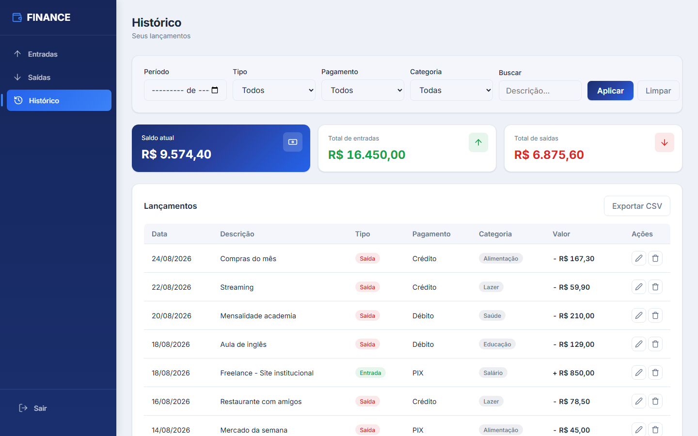

# FINANCE 💰

Sistema **full-stack** de controle financeiro pessoal. Registre entradas e saídas com categorias, filtre e analise seu histórico, acompanhe a evolução do saldo em gráficos e exporte seus dados em CSV.

> Aplicação de ponta a ponta com **TypeScript**, **Node.js**, **Express**, **PostgreSQL** e programação funcional com **Effect-TS**.

🔗 **Demo ao vivo:** [https://finance-flavio.vercel.app](https://finance-flavio.vercel.app)

---

## 🖼️ Visual


*Painel "Histórico": cards de resumo, filtros, tabela com categorias, ações de editar/excluir, gráficos (evolução do saldo + gastos por categoria) e exportação em CSV.*

---

## ✨ Funcionalidades

- **Autenticação** de usuários com **JWT** (register + login), com acesso isolado por usuário.
- Categorize lançamentos em 8 categorias fixas: alimentação, moradia, transporte, lazer, saúde, educação, salário e outros.
- **Filtros** por período (mês/ano), tipo, forma de pagamento, categoria e busca por texto.
- **Editar** e **excluir** transações.
- **Exportar** o histórico filtrado em **CSV** (com suporte a acentos).
- **Gráficos** em **SVG puro** (zero dependências): evolução do saldo e gastos por categoria.
- Layout responsivo (desktop `/` mobile).

---

## 🛠️ Stack

| Camada | Tecnologias |
|--------|-------------|
| **Frontend** | HTML · SCSS/Sass · TypeScript |
| **Backend** | Node.js · TypeScript · Express 5 |
| **Banco de dados** | PostgreSQL (Neon) |
| **Programação funcional** | Effect-TS |
| **Testes** | Vitest |
| **Deploy** | Vercel (frontend) · Railway (backend) |

---

## 🏗️ Arquitetura

O backend segue **arquitetura em camadas**, separando responsabilidades e facilitando testes e manutenção:

```
routes (definição de endpoints)
   ↓
controllers (tratamento HTTP e validação)
   ↓
services (regras de negócio)
   ↓
repositories (acesso ao banco de dados)
   ↓
PostgreSQL
```

### Programação funcional com Effect-TS

O fluxo de autenticação usa **Effect-TS** como fundação — o mesmo estilo adotado por times que tratam erros por construção. Erros são modelados como *tipos* (`Effect.Effect<T, E>`), compostos de forma segura e tratados explicitamente:

```ts
// src/services/auth.effect.ts
function findUser(email): Effect.Effect<User, InvalidCredentialsError | DatabaseError> {
  return Effect.tryPromise({
    try: () => findUserByEmail(email),
    catch: (cause) => new DatabaseError(cause),
  }).pipe(
    Effect.flatMap((user) =>
      user ? Effect.succeed(user) : Effect.fail(new InvalidCredentialsError())
    )
  );
}
```

- Erros tipados com *discriminated unions* (`InvalidCredentialsError`, `DatabaseError`, `ConfigurationError`).
- Composição com `Effect.flatMap`/`Effect.map` — sem *division by zero* por null/undefined não tratado.

---

## 🧪 Testes

```bash
cd backend
npm test
```

**24 testes** cobrindo validação de entrada, filtros e lógica de autenticação com Effect-TS.


---

## 🚀 Como rodar localmente

### Pré-requisitos

- Node.js 20+
- Conta gratuita no [Neon](https://neon.tech) (PostgreSQL na nuvem)

### 1. Banco de dados

No painel do Neon, abra o **SQL Editor** e execute o conteúdo de `backend/src/database/schema.sql`.

> Para bancos já existentes, rode `backend/src/database/migration_add_category.sql` para adicionar a coluna `category`.

### 2. Backend

```bash
cd backend
npm install
cp .env.example .env    # preencha DATABASE_URL e JWT_SECRET
npm run dev
```

### 3. Frontend

```bash
cd frontend
npm install
npm run build           # compila TypeScript e Sass para public/
npx serve public -p 3000
```

Acesse **http://localhost:3000**. (Em produção, o frontend aponta para o backend no Railway.)

---

## 🔐 Variáveis de ambiente (backend)

| Variável | Descrição |
|----------|-----------|
| `PORT` | Porta do servidor (padrão: 3001) |
| `DATABASE_URL` | Connection string do PostgreSQL |
| `JWT_SECRET` | Chave para assinar os tokens JWT |
| `FRONTEND_URL` | Origem permitida para CORS (ex.: frontend em Produção) |

---

## 📁 Estrutura

```
backend/
  src/
    config/         # conexão com o banco
    controllers/    # camada HTTP
    services/       # regras de negócio (+ auth.effect.ts com Effect-TS)
    repositories/   # acesso a dados
    models/         # tipos e DTOs
    routes/         # endpoints
    tests/          # testes (Vitest)
    database/       # schema.sql, migrações e seed
  public/  (frontend buildado)
```
